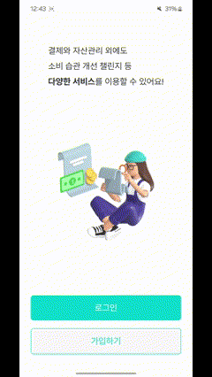
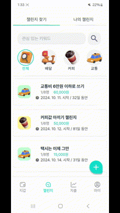

# CHALLET 챌린지에 참여해 소비습관을 개선하는 금융 서비스 

## 🚩프로젝트 설명
핀테크와 챌린지를 통한 소비습관 개선 플랫폼으로 소비습관을 효과적으로 관리하기 위한 설계된 서비스 입니다. 사용자의 편의성을 개선시키고자 결제시 자동으로 참여된 챌린지 방에 거래내역이 공유되며 공동의 목표를 가진 사람들과 챌린지를 통해 지출을 관리를 제공하는 서비스입니다.

## 📅 개발기간
- 2024.8.19. ~ 2024.10.10.(7주)

## 🖥 개발환경
- 배포 환경 : EC2 ubuntu(20.04.6)

## 아키텍쳐

## 주요기능

1. **은행 서비스**
    - 회원가입
    - 계좌 조회
    - QR 결제
    - 송금
    - 마이 데이터 연결
2. **챌린지**
    - 챌린지 생성 및 조회
    - 챌린지 진행
    - 리워드
3. **지출 및 통계**

## ✅ 기능 소개

### 회원가입

- 문자 인증을 통한 회원가입을 할 수 있습니다.

### 계좌 조회
- 계좌 내역 조회 및 계좌 내역 상세 조회를 할 수 있습니다. 

### QR 결제
- 간편비밀번호와 QR를 통해 결제를 할 수 있습니다.

### 계좌 이체
- 이체 전 이체 계좌의 존재 여부를 검사 합니다.
- 금액 입력 시 잔액 검사 후 송금이 가능합니다.

### 마이 데이터 연결
- 타 은행의 통장 연결 및 거래내역 조회가 가능합니다.

### 챌린지 조회
- 카테고리 및 검색으로 조회 할 수 있습니다.

### 챌린지 생성
- 카테고리와 기간, 인원을 선택하여 챌린지를 생성할 수 있습니다.

### 챌린지 진행
- 거래 시 자신이 참여하고 있는 챌린지에 자동으로 거래내역이 업데이트 됩니다.
- 이모지와 댓글로 피드백을 받을 수 있습니다.

### 리워드
- 종료한 챌린지 미션 달성 여부와 챌린지 상세 내용을 보여줍니다.

### 거래 내역 조회(캘린더)
- 챌렛 계좌와 마이테이터에 연결된 계좌의 거래내역을 조회합니다.

## 소비내역 통계 및 비교
- 한달 간의 카테고리 별 소비내역의 통계를 볼 수 있습니다.
- 자신과 비슷한 연령과 성별의 소비내역을 비교하며 소비습관의 인식을 높일 수 있습니다.

