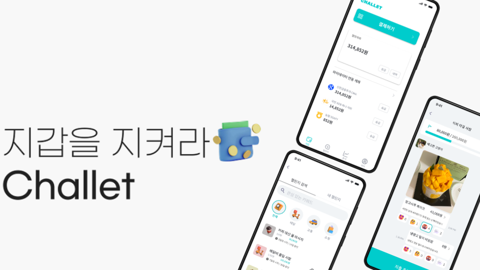

# CHALLET 챌린지에 참여해 소비습관을 개선하는 금융 서비스 

## 🚩프로젝트 설명
핀테크와 챌린지를 통한 소비습관 개선 플랫폼으로 소비습관을 효과적으로 관리하기 위한 설계된 서비스 입니다. 사용자의 편의성을 개선시키고자 결제시 자동으로 참여된 챌린지 방에 거래내역이 공유되며 공동의 목표를 가진 사람들과 챌린지를 통해 지출을 관리를 제공하는 서비스입니다.

## 📅 개발기간
- 2024. 8. 19. ~ 2024. 10. 10. (7주)

## 🖥 개발환경
- 배포 환경 : EC2 ubuntu(20.04.6)

## 아키텍쳐

